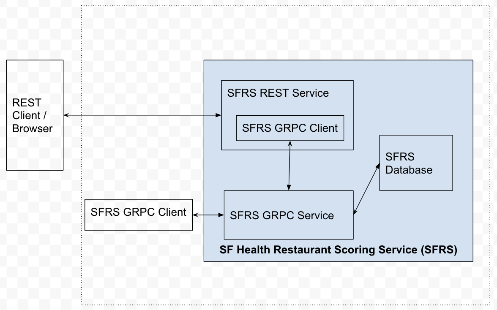

# San Fransisco Health Department Restaurant Score Service (SFRS)
## About
The work is an academic exercise completed in a limited time. Thus it needs a lot on the design and implementation part for being good.
## Objective
- The objective is get the following done in given time
 - Get the implementation done the CRUD operations using GRPC
 - Provide REST based APIs for these operation
## Assumptions
- The the database schema is already flattened and there is no effort done on normalizing it or thinking on any improvements on it
- The implementation of every aspect cannot be done in short duration so placeholders are kept for further code changes.

## Design

The design thought for the requirement is to create two servers. The database used is Postgres. GRPC server interacts with the database and provides the CRUD operations. REST server is client for the GPRS server and provides the REST services for these operations to its clients.
## Needed Improvements
- TODO sections in the code and unit tests for completion
- Use of config package and config.dat file for all hardcoded information
 - REST server details
 - Granular DB details
 - log file path
- Code restructuring and naming improvements 
- Build script to be created
- Addressing Security aspects
- Nice to have: Putting in a container image

## Using the work
Build script is yet to be created so, in order to run, the following can be done 
1. Create restaurant_scores table a Postgres database using sql/ddl.sql 
1. Provide the Postgres details in config/config.dat file
1. Build and execute grpcServer/main.go for running GRPC server
1. Build and execute restServer/main.go for running REST server
1. Make REST calls with /list /update /insert options e.g. http://localhost:8080/update